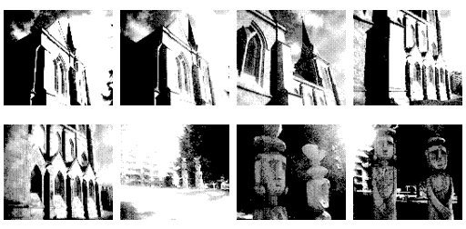
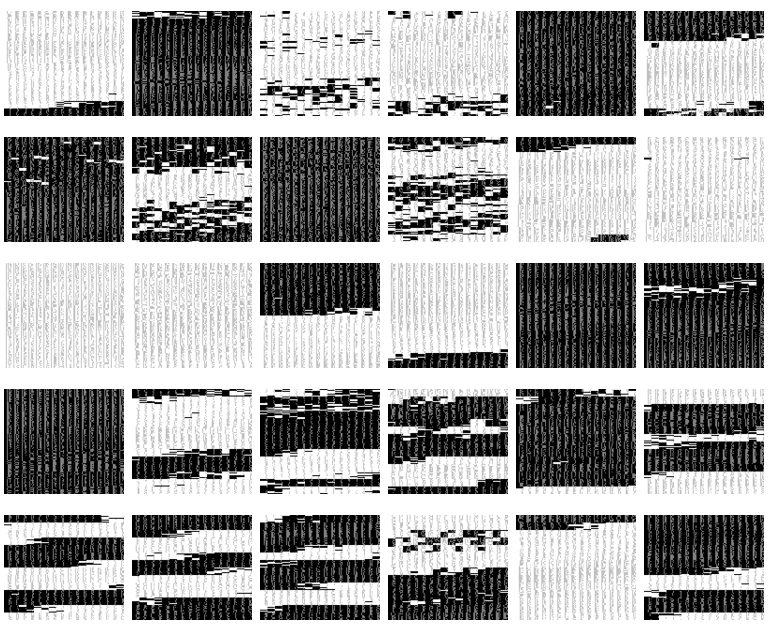

# Rombus Game Boy camera dumper



Extracts _.bmp_ photos from **GB** camera _.sav_ files.   
It's a CLI software intended to run under GNU/Linux environments but as it uses only standard libraries it should run under other systems.

- Supports thumbnails and full size photos. 
- Doesn't support game-faces nor music sheets.

## Noise

It does not have a validation that will prevent you for dumping pictures out of any binary aside **GB** camera _.sav_ files. If you ever wondered how _.mp3_ (or any other binary) files would look like interpreted as images, you can try that out.

Here's how one _.wav_ file looks like:




## Compiling

For compiling you need **gcc** and just open a terminal in this directory and type:

```bash
  make
```

To get instructions on how to use the program run it without arguments.
